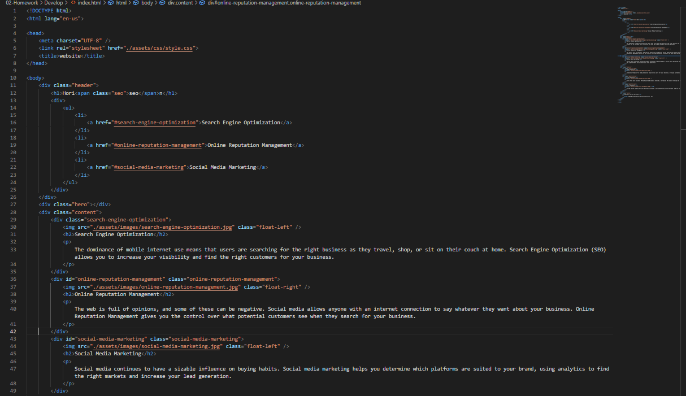
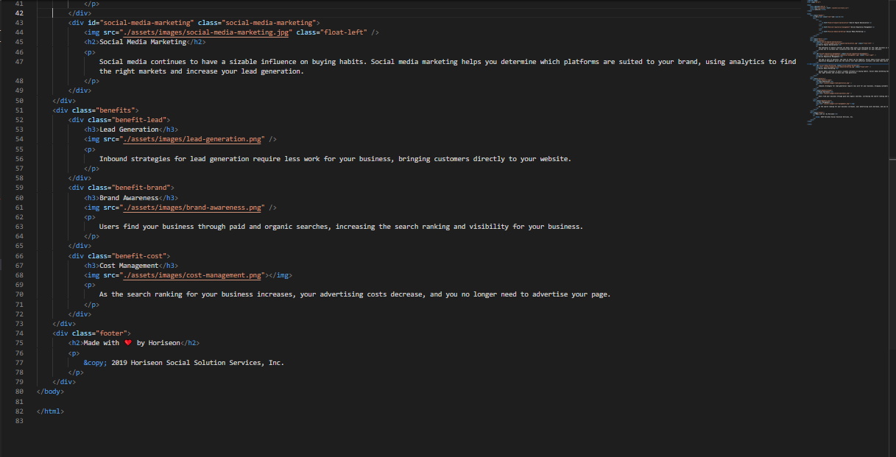
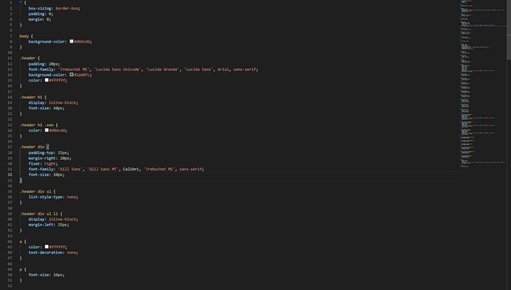
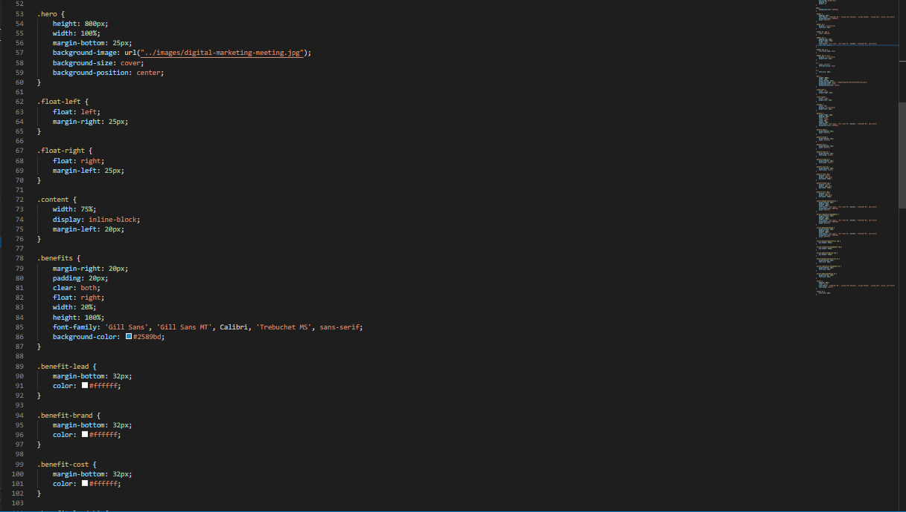
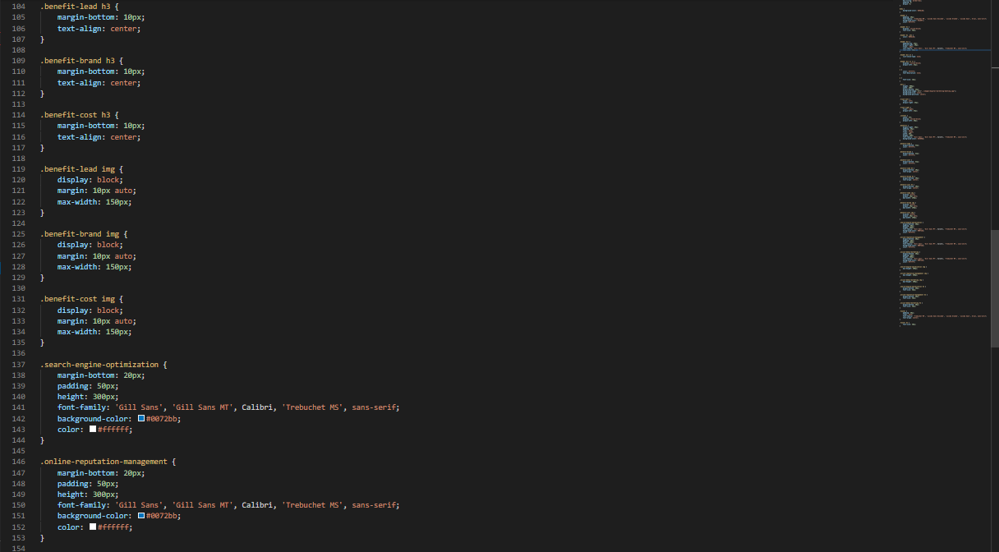
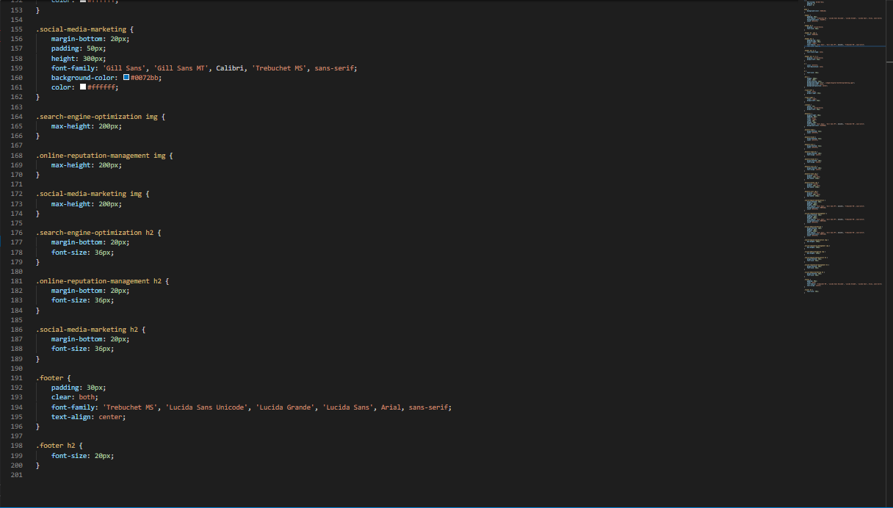

# HoriseonV.2

For this project we were assigned with a page with a code that barely worked and with a code completely unorganized.

# Our Goal?

Take the code and make it better, cleaner, and beauty. Our goal was to organized the code in such a way that any other person would be able to understand it.

I went from having this...

To the new and fresh code that you can find at index.html or style.css.

# Whats is new?

Well... 
* I added a title for the page, aswell a favicon.
* Change to semantic tags.
* Avoid repetition at the css page.
* Add comments to separate the places on the page.
* I fixed links that were not working before.
* Stop the content from getting out of the boxes when the page gets shrink.
* Centered and make it readable more easier.

# In other words....

This was a project that made me realize that organization in our codes is important. avoid repetition, is important. Semantic tags ARE important. And even if your code works, that does not mean, that it works, in the way that it should be.

